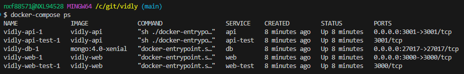
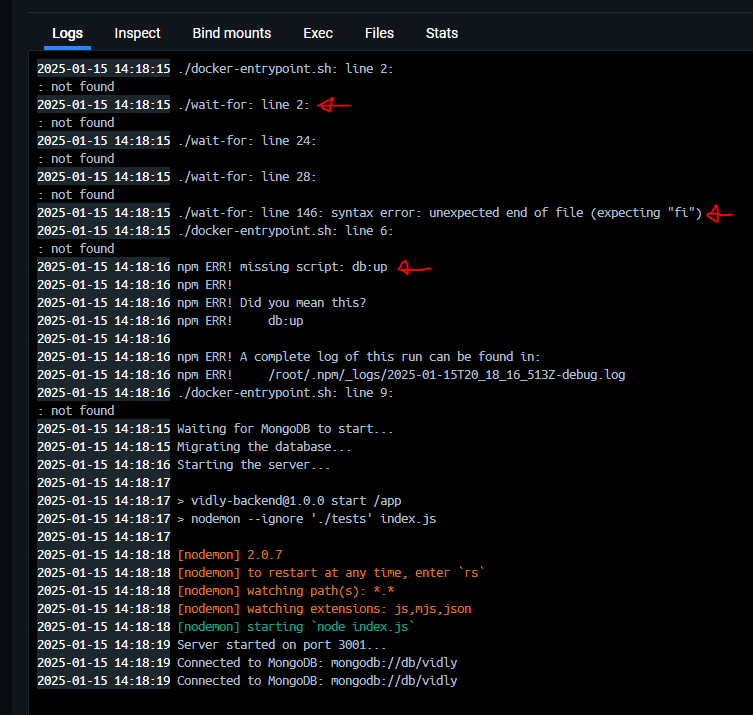
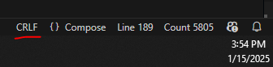

Multi-container Applications
============================

***This project is based on the course [The Ultimate Docker Course](https://codewithmosh.com/p/the-ultimate-docker-course) by Mosh Hamedani.***

Francisco Camargo

# Introduction

We build and run a multi-container application by learning to work with `docker-compose`. With this repo we build an application made up of a React front-end, a Node back-end, and a MongoDB database.

This project will teach us about

* Docker Compose
* Docker networking
* Database migration
* Running automated test

# OS differences

When running on Windows use

```bash
docker-compose
```

When running on Ubuntu use

```bash
docker compose
```

# Install Docker Compose

On Mac and Windows, Docker Engine already comes with Docker Compose. But if you need to install it seperatly, [here](https://docs.docker.com/compose/install/) is a guide.

Verify that Docker Compose is working by running

`docker-compose --version`

Here is a [guide](https://docs.docker.com/compose/install/linux/#install-using-the-repository) for Ubuntu.

# `docker-compose.yaml`

The `docker-compose.yaml` file is how we can orchestrate what would otherwise have to be a series of manual `docker` commands needed to launch the various assets of our application; frontend, backend, database, etc.

## Build Images

I'm having to build the images directly first, before running the application

`docker-compose build`

To force a build from scratch use

`docker-compose build --no-cache`

## Run Application

To run everything, from within the parent directory of this project, run

`docker-compose up`

This will build images if they are not built already

To run in detached mode

`docker-compose up -d`

Can check on containers with

`docker ps -a`

or

`docker-compose ps -a`

and images with

`docker images`

Can verify things are working by going to `localhost:3000` and seeing:


we can also check the status of all the containers:



### Shell script not found error

If you get a script not found error, try switching from

```bash
command: ./docker-entrypoint.sh
```

in `docker-compose.yaml` to

```bash
entrypoint: ['sh', './docker-entrypoint.sh']
```

or move it to the `backend/Dockerfile`

```bash
ENTRYPOINT ['sh', './docker-entrypoint.sh']
```

### End-of-Line Errors

I was then observing errors within the backend container (even though the app still seemed to run when I inspect in the browser). These went away when I change the end-of-line character from CRLF to LF in both `docker-entrypoint.sh` and `wait-for`



I was able to fix this by first visualizing the end-of-line characters with the `code-eol` VSCode extension by Soham Kamani. Then I could change the characters in VSCode via the GUI; [guide](https://blog.boot.dev/clean-code/line-breaks-vs-code-lf-vs-crlf/)



### `node_modules missing` Error

Getting a `node_modules missing` error (or `nodemon: not found`). This is described in the video [11-Publishing Changes](https://members.codewithmosh.com/courses/the-ultimate-docker-course-1/lectures/31450211). The error arises because the `api` host using `./backend` as a volume to reflect the source code, but `/node_modules` is not in the source code. The suggested solution is to run `npm install` from within the `./backend` source code folder and then run `docker-compose up`.

### Missing wait-for file

Keep getting error after running `docker-compose up` whereby the `api` container is unable to find the backend `wait-for` file. When I look at the container logs I see the following:

```shell
./docker-entrypoint.sh: line 4: ./wait-for: not found
```

## Stop Application

To stop and remove the containers
`docker-compose down`
However, the images and volumes will remain

### Remove database

View our volumes
`docker volume ls`
We will see a volume called `vidly_vidly` from `<directory>_<defined volume>`. We added a `<defined volume>` in our docker-compose and called it `vidly`. Now, recall that the `db` host uses `/vidly/data/db`, as defined in the docker-compose `db` section. Thus, by removing the volume `vidly_vidly`, we will have removed the database of our application.

Remove a volume
`docker volume rm <VOLUME NAME>`
`docker volume rm vidly_vidly`

# View in Browser

Given the ports chosen in `docker-compose.yaml`, we can view the frontend via
`http://localhost:3000`
the backend home page via
`http://localhost:3001/api`

# Docker Network

View the network
`docker network ls`

For this project we anticipate seeing a network created names `vidly_default`, this will contain the three hosts defined in the `docker-compose.yaml`. Let's probe this network; enter the shell of the web host
`docker exec -it -u root e98 sh`
The IP address of this container can be seen by running
`ifconfig`
and looking in the `eth0` section.

Let's pin the `api` host
`ping api`
That is, from the `web` host, ping the `api` host

# Viewing Logs

To view all the logs
`docker-compose logs`

To view the logs of only one container
`docker-compose logs <id>`

# wait-for-it

In the docker-compose api section, to make sure that the database is ready before the db migration script is run, we utilize [wait-for-it](https://github.com/vishnubob/wait-for-it/). In particular, we have a copy of `wait-for-it.sh` (saved as `wait-for`) under `/backend` which is then used by our `docker-compose.yaml` via `command: ./wait-for db:27017`

# Run Tests

From host computer
`cd frontend` and then
`npm test`

But how can we run tests in a container? Use `docker-compose.yaml`! To inspect the results of the tests for any of the containers, use `logs`, for example,
`docker logs <id>`

`docker logs vidly-web-test-1`
